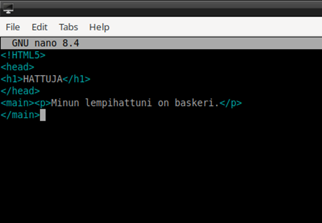

*h3 Hello Web Server*

**Tiivistelmä: Name Based Virtual Host**

•	Nimipohjaisilla palvelimilla useampi host voi käyttää samaa IP-osoitetta.

•	Tämä sekä säästää koko ajan vähenevien IPv4-osoitteiden tarvetta ja helpottaa myös konfigurointia.

•	Serveri valitsee oikean hostin hakemalla ensin sopivinta IP-osoitteen ja portin perusteella > kaikista sopivista vertailee ServerName- ja ServerAlias-tietoja.

•	’*’ eli wildcard eli jokerimerkki voi olla yksittäisen määritellyn IP-osoitteen sijasta, jolloin se jättää IP-osoitteen avoimeksi.

**localhost**

Olin jo asentanut Apache 2:n sekä uwf:n (uncomplicated fire wall), joten pääsin suoraan kokeilemaan localhostin vastaavuutta. Kirjoitin webbiselaimen osoitepalkkiin ’http://localhost’, josta vastaukseksi tuli Apachen oma default-sivu odotusten mukaisesti; sivun teksti itsessään kertoo suoraan, että Apache toimii oikein, jos tämä sivu näkyisi etusivulla.

**Apache Access Log**

Tail-komento palauttaa sisällön pyydetyn sijainnin loppupäästä; lisämääreillä pystyy tarkentamaan, kuinka paljon tietoja haluaa. Pääkäyttäjän oikeuksilla hain Apachen lokin viimeisimpiä tapahtumia, eli komento oli ’sudo tail /var/log/apache2/access.log’.

•	’127.0.0.1’ viittaa IPv4-osoitteeseen, josta pyyntö tuli. Tämä nimenomainen osoite viittaa aina hostiin.
•	’- - ’ viittaa pyynnön lähettäjään – varsinkin etummainen palauttaa yleensä juuri tämän väliviivan. Toisen viivan kohdalla voisi olla myös pyytäjän käyttäjänimi.
•	Pyynnön ajankohta (pp/kk/vvvv:hh:mm:ss aikavyöhyke)
•	’GET / HTTP/1.1’ on pyynnön tyyppi ja resurssi: GET osoittaa, että pyynnön tarkoitus oli vain saada dataa (ts. näyttää webbisivu), ja HTTP 1.1 on käytetty tiedonsiirron protokolla.
•	’200’ on http-statuskoodi, joka tarkoittaa pyynnön onnistumista.
•	’3383’ viittaa palautetun objektin kokoon.
•	Loki on combined-tyyppiä, eli viimeisenä siinä on käytetyn nettiselaimen tarkemmat tiedot.

**Etusivu uusiksi**

Loin /home/user-hakemistoon uuden hakemiston ’public-sites’ mkdir-komennolla, johon loin uuden tyhjän tiedoston index.html komennolla ’touch’. Avasin tiedoston nano-ohjelmalla (’nano index.html’) ja kirjoitin siihen yksinkertaisen HTML-sivun.

Sivun luotuani loin sen konfiguraatiotiedoston Apachen hakemistoihin lokaatioon ’/etc/apache2/sites-available’, itse tiedoston nimesin ’hattu.virva.com.conf’. Olennaiset tiedot konfiguraatiotiedostossa:

•	Portti 80 on oletuksena varattu hostille.
•	ServerName: sivun nimi, jolla se yksilöityy muista name-based virtual hostissa.
•	ServerAlias: muut domainnimet, jotka johtavat tälle sivulle.
•	DocumentRoot: sivun tiedostojen sijainti.
•	ErrorLog- ja CasualLog-kohdat määrittävät lokien sijainnin.

En ole varma, teinkö täysin oikein, kun loin sivuni sijainnin kotihakemistooni. Minusta tuntui, että se olisi pitänyt luoda ennemmin ’/var/www/html’-sijaintiin, joten siirryin takaisin index.html:n sijaintiin ja kopioin sen oikeaan paikkaan komennolla ’sudo cp index.html /var/www/html’.

Lopuksi laitoin sivun päälle komennolla ’sudo a2ensite SIVU’. Muita sivuja koneellani ei vielä ollutkaan, joten mitään ei tarvinnut laittaa pois päältä, mutta jos olisi, se olisi hoitunut vastaavasti ’sudo a2dissite SIVU’.

**Curl**

Curl-komento palauttaa pyydetyin määrein verkosta dataa. Komentoa voi käyttää esim. tiedostojen lataamiseen tai ihan vain verkkosivun toimivuuden testaamiseen. Pelkkä ’curl’ palauttaa sivun HTML-sisällön, kuten tässä kuvassa haettuani komennolla ’curl https://valitutlapset.wordpress.org/’.

’Curl -I’ näyttää haetusta sivusta pelkästään otsakkeen. ’curl -I http://localhost/’ antoi vastaavan tuloksen:

Monet sen antamista tiedoista ovat vastaavia kuin aiempana on selitetty Apachen lokitiedoista. ETag on http-protokollan osa, joka identifioi tietystä URL-osoitteesta saadun resurssin senhetkisen version kuvan tyyppisellä merkkijonolla. ETagien tarkoitus on säästää tarvetta hakea samaa resurssia yhä uudestaan, jos sivulla mikään ei ole muuttunut.
