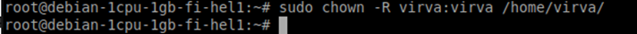
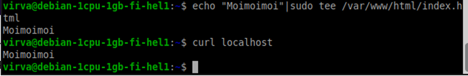

*h4 Maailma kuulee*

**Tiivistelmä:**

•	Vuokratessasi virtuaalipalvelinta valitse lähellä oleva datakeskus. 

•	Käytä aina vahvoja ja yksilöllisiä salasanoja. Älä käytä huonoa salasanaa edes väliaikaisesti.

•	Avaa SSH:n käyttämä tcp-portti 22 (’sudo ufw allow 22/tcp’) ennen palomuurin päälle laittamista, jottet vahingossa lukitse itseäsi ulos.

•	Ensimmäistä kertaa kirjauduttaessa käytetään palvelimen juurta (root). Saman tien luodaan palvelimelle varsinainen (pää)käyttäjä.

•	Palomuuriin täytyy ”tehdä reiät”, jotta haluttu tietoliikenne pääsee kulkemaan: tärkeät portit ovat 22, 80 ja 443.

**Virtuaalipalvelimen vuokraus**

Valitsin virtuaalipalvelimen vuokrauspalveluksi Upcloudin, koska Teron luennolla oli käytetty sitä esimerkkinä ja yrityksen kotimaisuus puolsi valintaani. Loin itselleni tilin tähän palveluun jo tunnilla.

Tero painotti tunnilla useampaan otteeseen vahvojen salasanojen tärkeyttä: hyvä salasana olisi ainutlaatuinen (ei yhden ja saman salasanan kierrätystä joka paikassa), pitkä, vaikeasti arvattava ja useita merkkityyppejä sisältävä. Yleinen tapa salasanojen hallintaan on käyttää password manageria, jossa ne ovat itsellä ylhäällä – hyvä salasana todennäköisesti on myös vaikea muistaa ulkoa.

Olen kehittänyt itselleni oman tekniikan salasanojen luontiin. Olen keksinyt monivaiheisen kaavan, jolla salasana luodaan käyttäen vastaavan palvelun nimeä pohjana, mutta kaava on monimutkainen, epälooginen ja ainoastaan minun tiedossani. (Esimerkki: kuvittele, että tiettyyn kohtaan salasanaa tulisi aina 1- tai 2-numeroinen luku sen perusteella, kuinka mones aakkonen olisi kirjauduttavan palvelun nimen kolmanneksi viimeinen kirjain, ja tämän luvun tarkka sijainti riippuisi siitä, missä kuussa aloitin palvelun käytön). Tällä tavoin olen saanut luotua vahvoja salasanoja, ja muistaessani kaavan ulkoa en tarvitse password manageria.

Tein Upcloudiin salasanan tällä omalla menetelmälläni. Loin (deploy) sitten oman virtuaalipalvelimeni, jonka määritin mahdollisimman yksinkertaiseksi: RAM-muistia, tallennustilaa ja prosessoreita minimimäärät eikä maksullisia lisäpalveluja. Tunnistautumistavaksi valitsin SSH-avaimen.

Samalla avasin paikallisen virtuaalikoneeni terminaalin ja tarkistin, että SSH:n viimeisin versio oli asennettuna; ’sudo apt-get install’ -komento antoi vain ilmoituksen, että SSH oli jo asennettu ja päivitetty. Loin uuden avaimen ’ssh keygen’  kolme peräkkäistä Enter-painallusta  kopioin saamani julkisen avaimen (public key) Upcloudin serverin tietoihin ”Add new SSH key”.

Kokeilin kirjautumista etäpalvelimelle SecureShellillä: ’ssh root@(palvelimen IPv4-osoite)’. Ensimmäisen kerran näin tehdessäni sain varoituksen siitä, että yhteyttä tähän koneeseen ei oltu todennettu aikaisemmin. Jatkoin syöttämällä ’yes’.

Onnistuttuani tässä aloitin päivittämällä kaikki koneen ohjelmat (’sudo apt-get update’, ’sudo apt-get upgrade’). Loin itseni etäpalvelimen uudeksi käyttäjäksi. ’sudo adduser virva’  uuden salasanan määrittäminen  muiden tietojen täyttäminen (täytin tähän vain koko nimeni, mutta muut ohitin Enterillä). Sitten annoin itselleni pääkäyttäjän oikeudet ’sudo adduser virva sudo’ ja kopioin SSH-asetukset kotihakemistooni.

Minulle ei ollut heti selvää, mitä ohjeissa ollut ’chown’-komento tarkoitti. Pikaisella selvittelyllä ymmärsin, mistä on kyse: komento on omistajanvaihdos (CHange OWNer), eli ’chown -R virva:virva /home/virva/’ antoi käyttäjätililleni /home/virva/-lokaation omistusoikeudet rekursiivisesti eli koskien kaikkia ko. sijainnin alihakemistoja.

**Palomuuri ja weppipalvelin**

Poistuin SSH-tilasta (’exit’) ja kirjauduin uudestaan, tällä kertaa juuri luomalleni käyttäjälle ’ssh virva@ip-osoite’. Asensin palomuurin ’sudo apt-get install ufw’ ja tein sille tarvittavat konfiguraatiot: avasin siitä portit 22 (SSH:ta varten), 80 (yleinen http-portti) ja 443  (https). Käytetty komento oli ’sudo ufw allow (portin numero)/tcp’.

’sudo ufw status verbose’ paljasti, että palomuuri oli poissa päältä, joten se olisi tullut laittaa päälle komennolla ’sudo ufw enable’. Kuvan tilanteessa kuitenkin peruutin (n), koska kone varoitti toiminnon ehkä vaikuttavan käynnissä olevaan SSH-istuntoon enkä ollut varma, olisiko turvallista jatkaa. Kävin kuitenkin laittamassa palomuurin myöhemmin päälle, kun ymmärsin päällelaiton olleen tuossa kohtaa jo turvallista, koska portti 22 oli jo auki.

**Root-käyttäjän lukitseminen**

Lukitsin etäpalvelimen root-käyttäjän komennolla ’sudo usermod –lock root’ ollessani kirjautuneena sisään toisena (eli aiemmin tehdyllä virva-)käyttäjänä. Viimeistelin teon nimeämällä juurikäyttäjän /root/.ssh uudelleen niin, että nimessä oli nyt ’DISABLED’, estetty. (’sudo mv -nv /root/.ssh /root/DISABLED-ssh’).

**Hei maailma**

Olin toki aiemmin asentanut etäkoneelle Apache 2:n ’sudo apt-get install apache2’.

Luin ohjeita vähän huolimattomasti, sillä en saanut nyt testattua, näkyikö localhostissa Apachen oletussivu. Tein kuitenkin sivuun muutoksia testailua varten. Käytin putkea kirjoittaakseni oletussivulle tekstin ”Default”: ’echo ”Default”| sudo tee /var/www/html/index.html’. Muokkasin sen jälkeen vielä uudestaan samalla komennolla, mutta echolla kirjoitettava teksti olikin ”Moimoimoi”.

’curl localhost’ palautti ainoastaan tekstin ”Moimoimoi”, minkä pitikin olla nyt sivulla ainoa asia. Tarkistin asian vielä siirtymällä ko. IP-osoitteeseen omalla Windows-läppärilläni.

