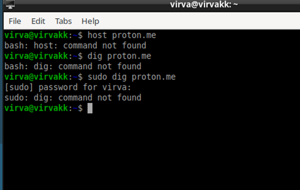
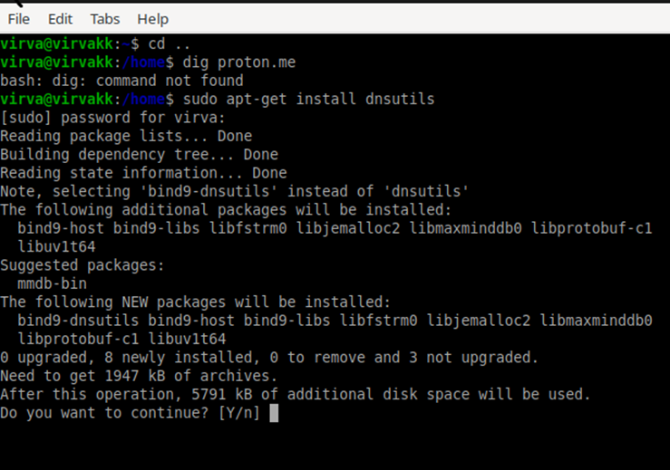
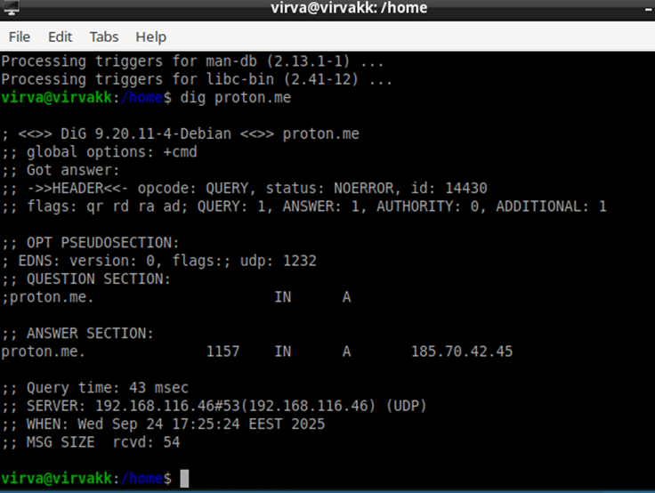
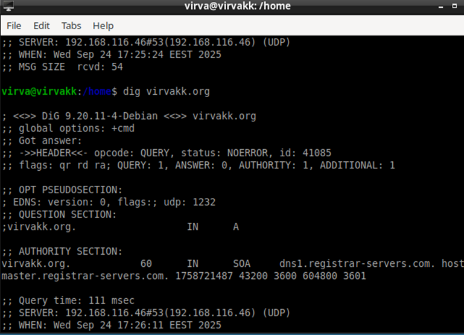
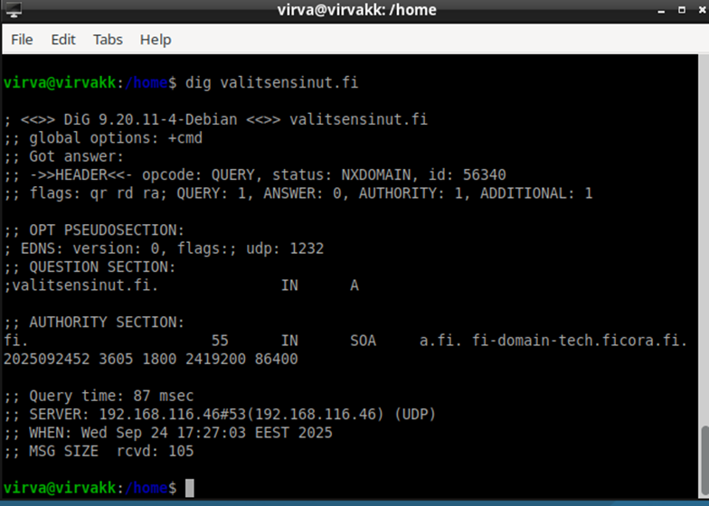
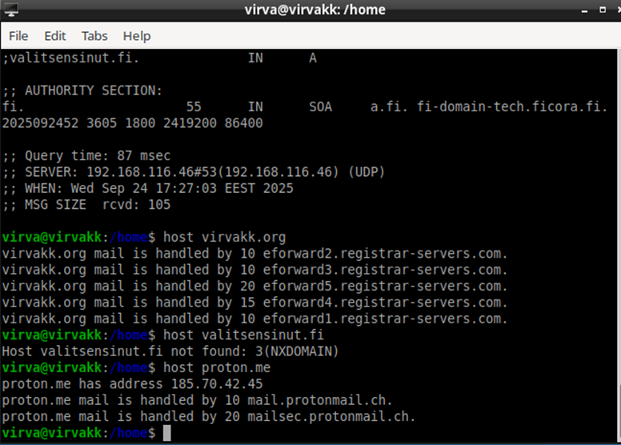

*h5 Nimekäs*

**Julkinen nimi**

Aloitin hankkimalla julkisen domainin. Opettajan ohjeissa suositeltiin yhtenä palveluntarjoajana NameCheapia, joten vuokrasin sieltä nimen ’virvakk.org’. En omistanut tätä ennen NameCheap-tiliä, joten loin itselleni käyttäjätunnuksen ja vahvan salasanan sekä syötin kysytyt henkilö- ja maksukorttitiedot. Koska aikomukseni ei ollut ostaa tätä nimeä pysyvään, esim. omien ammattimaisten kotisivujen käyttöön, varmistin, että jatkuvan tilauksen kohta oli tyhjänä.

Nimen osto piti vielä varmistaa sähköpostiin lähetetyn linkin kautta. Kun se oli tehty, tein kaksi alidomainia: sivupalkin Domain List  haluttu domain  Advanced DNS. Tässä näkymässä valinta ’Add new record’. Valitaan tietuetyyppi, hostnimi, ja viimeiseksi tietuetyypin mukainen arvo, johon alidomain viittaa. Tein ensiksi CNAME-tietueen, jolla alidomain laitetaan osoittamaan tiettyyn domainnimeen.

Toisen alidomainin tein A-tietueella, joka osoittaa määritettyyn IPv4-osoitteeseen.

Avasin sitten virtuaalikoneen komentorivin. Käsky ’hostnamectl’ näytti tämänhetkisen hostin tiedot. Sudo-oikeuksilla ’hostnamectl set-hostname virvakk.org’ laitoin hankkimani nimen osoittamaan tähän koneeseen. Tarkistin vielä uudella ’hostnamectl’-komennolla, että nimi oli tosiaan vaihtunut.

Nimeä vaihdettaessa kone pyysi tunnuksiani muutoksen varmentamiseksi.

**Host ja dig**

Minulla oli ensin vaikeuksia saada host- ja dig -komennot toimimaan, sillä sain virheeksi ’bash: command not found’. Koetin ratkaista ensin suorittamalla komennot sudo-käyttäjänä, mutta tämäkään ei auttanut. Sain selville, että minulta puuttui olennainen dnsutils-package, joten asensin sen ensin, jolloin komennot alkoivatkin toimia.

Tein ensin dig-kyselyt kolmelle osoitteelle: omaan domainnimeeni, Valitsen sinut! -harrastajateatteriryhmän kotisivuille ja Proton-palvelun sivuille.

QUESTION- ja ANSWER -osiot viittaavat kyselyn kohteeseen ja kyselyyn vastanneeseen palvelimeen. Kummassakin tunnus IN viittaa kyselyn tyyppiin, jossa IN tarkoittaa Internetiä, ja sen jälkeinen sarake tietuetyyppiin: A eli Address viittaa IPv4-osoitteeseen, kun taas vastausten tietue on ollut SOA (Start of Authority), joka sisältää tärkeää tietoa kuten ylläpitäjän e-mailin ja näyttää sen nimipalvelimen, jolle kysely meni. ANSWER-osio sisältää myös TTL (Time To Live)-tiedon, joka kertoo mm. DNS-tietueiden säilymisajan paikallisen palvelimen välimuistissa.

Host-komento samoilla osoitteilla tuotti hyvin erilaisia tuloksia. Proton.men kysely palautti sivun IP-osoitteen sekä kaksi MX-tietuetta eli tietoa sähköpostipalvelimista. Alempi luku merkitsee korkeampaa prioriteettia, eli ensin palautunut (10) on ensisijaisessa käytössä ja jälkimmäinen backup (20).

Virvakk.orgin kohdalla host palautti ainoastaan viisi MX-tietuetta, joiden prioriteetit vaihtelivat 10 ja 20 välillä.

Valitsensinut.fi palautti ainoastaan virheilmoituksen not found: 3(NXDOMAIN). Virhetunnuksen merkitys on (No eXisting DOMAIN), eli kelvollista domainia ei löydy.

*Lähteet*

https://www.namecheap.com/support/knowledgebase/article.aspx/9776/2237/how-to-create-a-subdomain-for-my-domain/#url

https://www.cyberciti.biz/faq/how-to-change-hostname-on-debian-10-linux/
