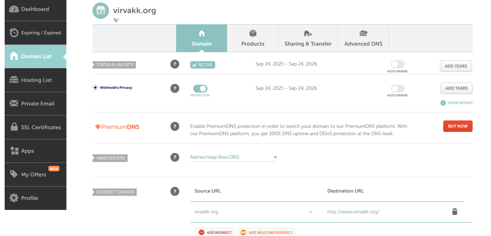
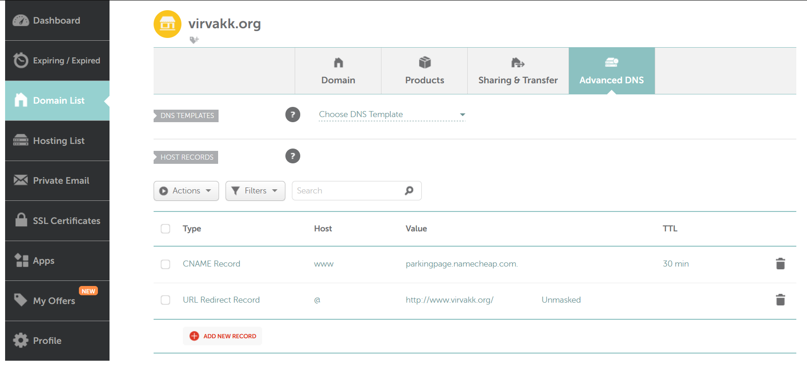
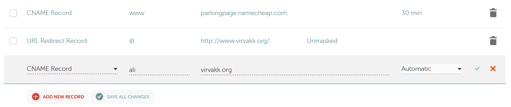
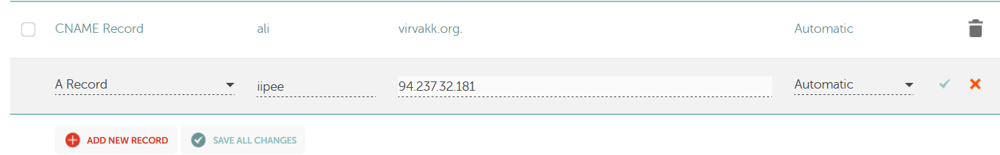
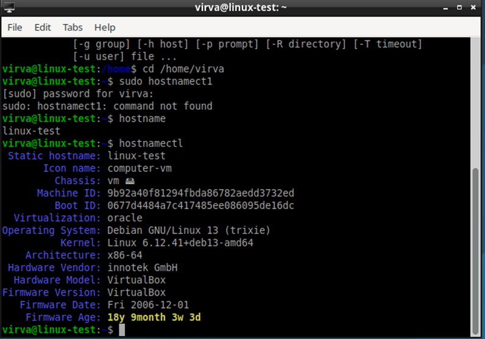
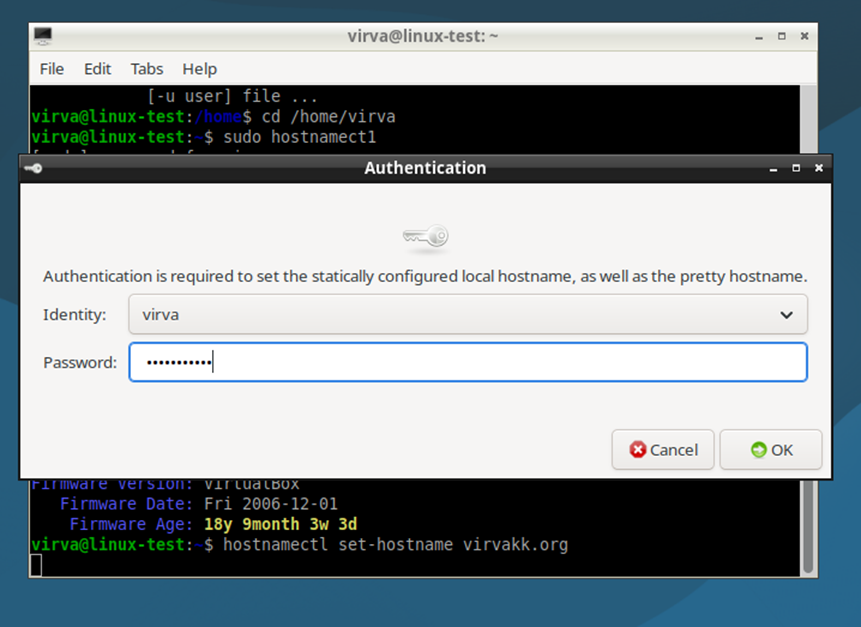
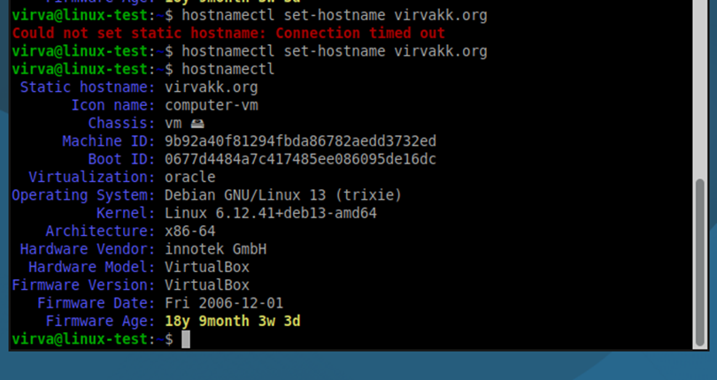

*h5 Nimekäs*

**Julkinen nimi**

Aloitin hankkimalla julkisen domainin. Opettajan ohjeissa suositeltiin yhtenä palveluntarjoajana NameCheapia, joten vuokrasin sieltä nimen ’virvakk.org’. En omistanut tätä ennen NameCheap-tiliä, joten loin itselleni käyttäjätunnuksen ja vahvan salasanan sekä syötin kysytyt henkilö- ja maksukorttitiedot. Koska aikomukseni ei ollut ostaa tätä nimeä pysyvään, esim. omien ammattimaisten kotisivujen käyttöön, varmistin, että jatkuvan tilauksen kohta oli tyhjänä.

Nimen osto piti vielä varmistaa sähköpostiin lähetetyn linkin kautta. Kun se oli tehty, tein kaksi alidomainia: sivupalkin Domain List  haluttu domain  Advanced DNS. Tässä näkymässä valinta ’Add new record’. Valitaan tietuetyyppi, hostnimi, ja viimeiseksi tietuetyypin mukainen arvo, johon alidomain viittaa. Tein ensiksi CNAME-tietueen, jolla alidomain laitetaan osoittamaan tiettyyn domainnimeen.

Toisen alidomainin tein A-tietueella, joka osoittaa määritettyyn IPv4-osoitteeseen.

Avasin sitten virtuaalikoneen komentorivin. Käsky ’hostnamectl’ näytti tämänhetkisen hostin tiedot. Sudo-oikeuksilla ’hostnamectl set-hostname virvakk.org’ laitoin hankkimani nimen osoittamaan tähän koneeseen. Tarkistin vielä uudella ’hostnamectl’-komennolla, että nimi oli tosiaan vaihtunut.

Nimeä vaihdettaessa kone pyysi tunnuksiani muutoksen varmentamiseksi.

*Lähteet*

https://www.namecheap.com/support/knowledgebase/article.aspx/9776/2237/how-to-create-a-subdomain-for-my-domain/#url

https://www.cyberciti.biz/faq/how-to-change-hostname-on-debian-10-linux/
